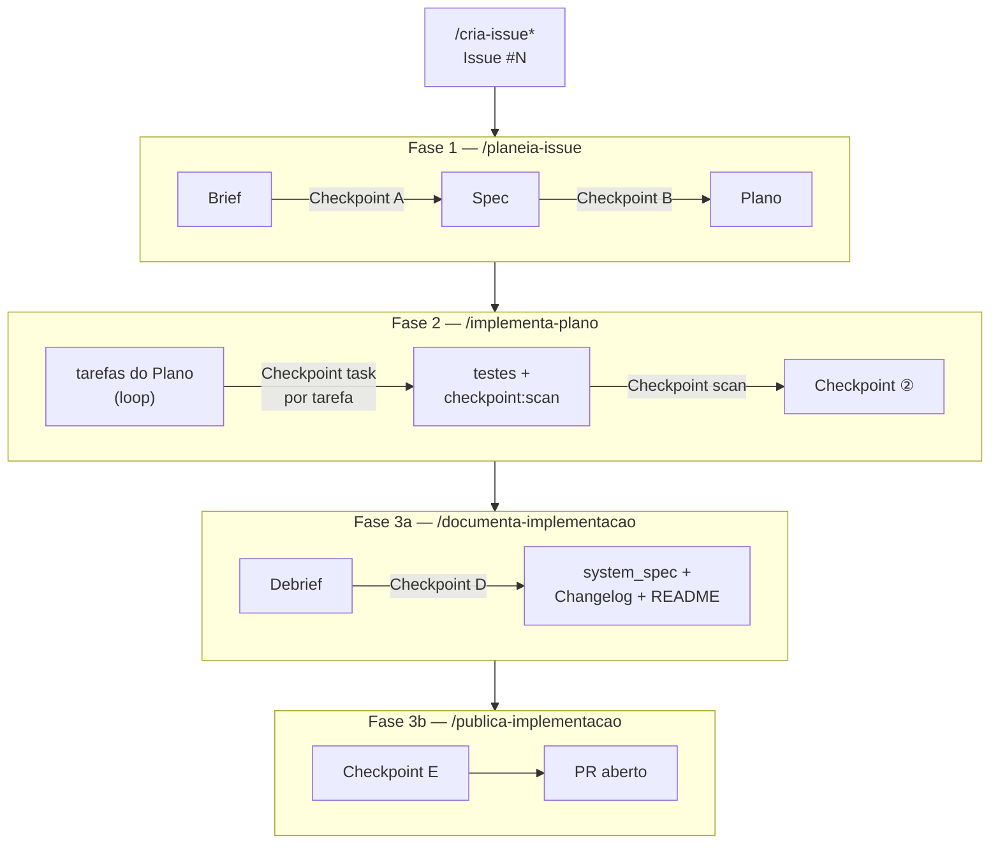

# Workflow deste repositório

> Como este repositório é trabalhado com Claude Code: comandos, skills e agentes, e a
> sequência das fases de uma issue. Para o detalhe de cada comando, abrir o ficheiro
> correspondente em `.claude/commands/`.

## As 3 camadas

```
Commands  → o que o utilizador invoca (/planeia-issue, /implementa-plano, ...)
Skills    → passos reutilizáveis que os commands chamam (escreve-brief, executa-testes, ...)
Agents    → subagentes lançados por commands/skills quando a tarefa justifica (Explore, Plan)
```

- **Commands** (`.claude/commands/*.md`) — pontos de entrada com `$ARGUMENTS`, pré-condições e
  passos. Correspondem a uma fase do workflow (ver tabela abaixo).
- **Skills** (`.claude/skills/*.md`) — unidades de trabalho reutilizadas por vários commands
  (ex: `executa-testes`, `pausa-checkpoint`, `regista-aviso`). Não são invocadas directamente
  pelo utilizador — os commands chamam-nas internamente.
- **Agents** — subagentes (Explore, Plan, general-purpose) lançados quando a tarefa beneficia
  de investigação paralela ou isolamento de contexto.

O estado entre fases persiste em `docs/workflow-state.md` (existe só enquanto uma issue está
em curso) e avisos de processo em `docs/process-warnings.md` (só entradas activas —
`PENDENTE`/`PARCIALMENTE RESOLVIDO`; histórico de `RESOLVIDO`/`IGNORADO` em
`docs/process-warnings-concluidos.md`).

## Skills

Skills de workflow (invocadas internamente pelos commands, não pelo utilizador):

| Skill | Propósito |
|---|---|
| `escolhe-issue` | Selecciona automaticamente a próxima issue pronta a implementar |
| `escreve-brief` | Expande a Issue num Brief estruturado |
| `escreve-spec` | Traduz o Brief em requisitos técnicos verificáveis |
| `escreve-plan` | Decompõe a Spec em tarefas concretas e commitáveis |
| `executa-testes` | Executa os testes do stack activo, com auto-retry até 3x |
| `executa-checkpoint-scan` | Executa o scan de segurança/qualidade do Checkpoint |
| `executa-triagem-semantica` | Revisão semântica — nomenclatura, legibilidade, duplicação |
| `pausa-checkpoint` | Pausa o fluxo e aguarda resposta com conteúdo do utilizador |
| `propoe-commit` | Formata e propõe commit em conventional commits (PT, emoji) |
| `regista-aviso` | Regista erro/anomalia de processo em `process-warnings.md` |
| `escreve-debrief` | Gera o Debrief a partir do git log e diff |
| `actualiza-spec` | Actualiza `docs/system_spec/` com base no Debrief |
| `actualiza-changelog` | Adiciona entrada ao `CHANGELOG.md` (Keep a Changelog) |
| `actualiza-readme` | Actualiza o `README.md` se a implementação expõe rotas/stack/uso |
| `propoe-pr` | Cria o PR no GitHub após confirmação (Checkpoint E) |

> `laravel-best-practices`/`pest-testing` também vivem em `.claude/skills/` mas são skills de
> conhecimento de domínio — auto-activadas pelo Claude Code ao escrever código Laravel/Pest, fora
> do fluxo Commands → Skills → Agents acima.

## Comandos por fase

| Command                                    | Fase    | Produz                                               |
| ------------------------------------------ | ------- | ---------------------------------------------------- |
| `/cria-issue <descrição>`                  | —       | Issue #N (genérica)                                  |
| `/cria-issue-modelo [entidade]`            | —       | Issue para migration + model + factory + testes      |
| `/cria-issue-persistencia [entidade]`      | —       | Issue para interface + repositório + DTOs + testes   |
| `/cria-issue-logica [entidade]`            | —       | Issue para Actions + Controller + Events + testes    |
| `/planeia-issue [#N]`                      | Fase 1  | Brief + Branch + Spec + Plano                        |
| `/implementa-plano [#N] [--stack laravel]` | Fase 2  | Código + Commits                                     |
| `/documenta-implementacao [#N]`            | Fase 3a | Debrief + system_spec + Changelog + README           |
| `/publica-implementacao [#N]`              | Fase 3b | PR no GitHub                                         |
| `/mostra-workflow`                         | —       | Estado actual do workflow                            |
| `/ajusta-workflow [descrição]`             | —       | Corrige/classifica ajuste de processo no local certo |

## Sequência de uma issue



> Detalhe de cada checkpoint na tabela "Checkpoints humanos" abaixo; estado persiste em
> `workflow-state.md` por fase e é removido por `/publica-implementacao` no fecho.

Em qualquer fase, `/mostra-workflow` mostra o estado actual (útil para retomar após pausa), e
`/ajusta-workflow` corrige desvios de processo — nunca despejando o ajuste directamente em
`CLAUDE.md` ou memória, mas classificando-o para `docs/system_spec/`, `.claude/commands/` ou
`.claude/skills/` conforme a natureza da mudança.

## Checkpoints humanos

Nenhuma fase avança sem uma pausa explícita para decisão/validação do utilizador — a skill `pausa-checkpoint`
implementa os 6 tipos abaixo e **nunca aceita "sim" isolado** como resposta suficiente; exige
conteúdo que demonstre compreensão real da decisão.

| Checkpoint | Quando                                               | O que confirma                                                                                                                                                                 |
| ---------- | ---------------------------------------------------- | ------------------------------------------------------------------------------------------------------------------------------------------------------------------------------ |
| **A**      | Após o Brief (`/planeia-issue`)                      | O que muda no domínio, que risco existe, que camada é mais afectada — nas palavras do utilizador. Bloqueia avanço para a Spec enquanto houver questões em aberto sem resposta. |
| **B**      | Após a Spec (`/planeia-issue`)                       | Spec verificada contra a secção Arquitectura do `CLAUDE.md` — desvios e violações de "O que NÃO fazer" listados explicitamente antes de confirmar.                             |
| **task**   | Após cada tarefa (`/implementa-plano`)               | Ficheiros alterados lidos pelo utilizador; só depois disso o commit é proposto (`propoe-commit`) e executado — nunca automático, nunca `--no-verify`.                          |
| **scan**   | Fecho da Fase 2 (`/implementa-plano`, stack Laravel) | `php artisan checkpoint:scan` — se houver FAILs, pausa e aguarda `[ok]` (regista aviso e prossegue) ou `[stop]` (utilizador corrige antes de continuar).                       |
| **②**      | Após todas as tarefas (`/implementa-plano`)          | Resumo por ficheiro + testes + scan, antes de avançar para a documentação.                                                                                                     |
| **D**      | Após o Debrief (`/documenta-implementacao`)          | O porquê de cada decisão tomada na issue — em especial as não óbvias — antes de propagar para o `system_spec`.                                                                 |
| **E**      | Antes do PR (`/publica-implementacao`)               | Capacidade de defender cada decisão do PR body perante um revisor.                                                                                                             |

Este é o mecanismo concreto de supervisão sobre trabalho gerado por IA neste repositório:
nenhum commit, alteração ao `system_spec` ou PR acontece sem uma decisão explícita e justificada
num destes pontos — não uma aprovação genérica.
